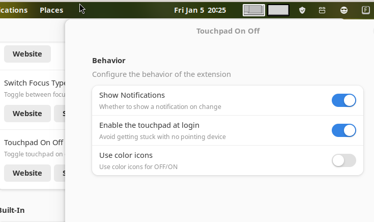

# TouchPad On-Off

By Romano Giannetti <romano@rgtti.com> , <romano.giannetti@gmail.com>

### Rationale

Most laptops have a key combination (usually some Fn-*thing*) to enable/disable the touchpad.
But not all of them. My Lenovo Yoga L13, for example, doesn't have one.
This extension just enables/disables the touchpad; 
by default it restores the touchpad in the enabled state when you logout and login,
but you can choose to just remember the old state in the options.

### Features

Click on the icon to change from Touchpad On to Off. 

Each click toggle the status.

### Options

* You can choose to have a notification for each change of status or not.
(default yes)
* You can choose if the touchpad starts enabled after login (default yes) or if it remembers the last value.
* You can opt for more colorful icons if you do not like the standard ones (contributed by @corebots).

### I'm stuck!

If you are stuck without mouse or touchpad, open a terminal window
or the command prompt of gnome shell (with Alt-F2) and issue 

    dconf write /org/gnome/desktop/peripherals/touchpad/send-events true

...and you'll have your touchpad back.

